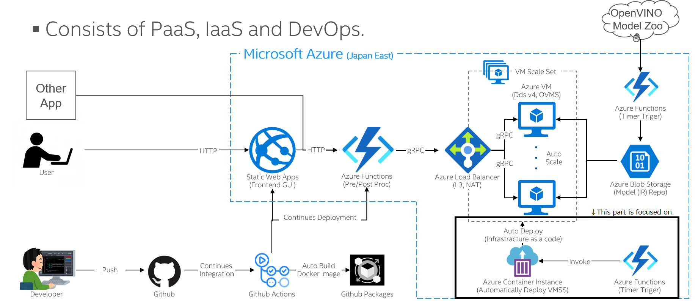

# Edge-to-Cloud 継続的自動再学習ソリューション
これは[Hitach x Intel - AI Hackason](https://hackathon.we-are-ma.jp/aihackathon2021/)にてエキシビジョンチームが作成した成果物です。
エッジデバイスにおけるAI推論とクラウド上でのモデルの自動再学習を実現します。本レポジトリでは主にクラウド側の仕組みに関して記載いたします。

## アーキテクチャー
本ソリューションのアーキテクチャーはこちらの図の通りです。今回はクラウドプラットフォームとしてMicrosoft Azureを使用していますが、同様の考え方は他のクラウド上でも適用可能です。


## 処理の流れ
1. エッジデバイスからクラウドへ画像をアップロード

    - エッジデバイス上ではディープラーニングモデルを使用した推論処理が行われております。ただし、モデルの運用中に正確に認識できなかった画像（映像からフレーム切り出し）や追加で学習させておきたい画像などを都度クラウドストレージへアップロードします。

1. アノテーション

    - アノテーション担当チームが定期的にクラウドストレージの中身を確認し、アノテーション作業を行います。
    

1. 再学習用サーバーの自動生成

    - アノテーション終了後に担当者が作業完了通知をシステムに送信します。すると、それをトリガーとして学習用のサーバーが自動で生成され、学習が開始されます。

1. モデルの再学習

    - サーバー上でデータ前処理およびモデルの学習処理が実施されます。データセットのボリュームにもよりますが、数分から数時間程度かかります。

1. 再学習完了通知とサーバー自動削除

    - 学習が完了すると、学習サーバーはその旨を完了通知としてシステムに送信します。それをトリガーとして、学習サーバーは自動で削除されます。
    - この処理により、学習用サーバーを学習処理の間のみ起動しておくことができるため、クラウド利用コストの最適化が実現できます。

1. モデルの性能検証

    - モデルの学習が完了すると、AIエンジニアによりモデルの性能検証が行われます。これは現在使用しているエッジデバイス上での性能検証、または、その他のデバイスでの性能検証も含まれます。
    

1. モデルの展示

    - 検証が完了したモデルは確認用にWebアプリケーションとして公開されます。これにより非技術系の関係者もWebブラウザからを簡単に試すことができます。
    

1. エッジデバイスへのモデルデプロイ

    - 学習済みモデルのエッジへの取り込みはエッジ側のタイミングで行います。具体的には、デバイス未使用時やデバイス起動時などに学習済みモデルをクラウドからダウンロードして使用します。

## 処理の流れ（技術的観点）
1. エッジデバイスからクラウドへ画像をアップロード

    - 本ハッカソンでは、日立製エッジデバイスエッジ環境として、Microsoft Azureをクラウド環境として使用しました。また、クラウドストレージはAzure Filesを使用しました。

1. アノテーション

    - 本ハッカソンでは、アノテーションツールとしてインテルのCVATを使用しています。CVATをAzure VM上にデプロイし、リモートから複数人が同時並行でアノテーションを実施可能です。
    

1. 再学習用サーバーの自動生成

    - 具体的には、アノテーション担当者がアノテーション済みデータセット（.zip）を特定のAzure Filesに格納した後、Azure Storage Explorerを使用して、Azure Queue Storage上の特定のメッセージキューにアノテーション済みデータセットのファイル名をキューイングします。すると、そのキューイングをトリガーとしてAzure Functionsが起動し、PowerShellにより、Azure Container Instances（ACI）を生成します。さらに、ACI上でAzure CLIにより目的のAzure VMが生成され、VM拡張機能により起動時にセットアップ処理と学習処理が行われます。

1. モデルの再学習

    - Azure Filesからデータセットを取得し、それを学習用と検証用（Train/Val）に7対3の割合で分けます。この際にインテルのDatumaroというデータ変換ツールが使用されます。その後、学習処理が開始するのですが、そこで使用されているのがインテルのOpenVINO Training Extensionという転移学習ツールになります。
    - OpenVINO Training Extensionの動かし方については[こちら](ote.md)を参照のこと

1. 再学習完了通知とサーバー自動削除

    - 学習が完了すると、Azure VMから学習済みモデルがAzure Filesに保存され、次回の学習で使用されます。また、OpenVINOのIR形式への変換も行われ、IRファイルがAzure BLOBへと格納されます。加えて、学習完了の旨をSlackへと通知します。それらを実施後にAzure Storage Queueへ完了メッセージをキューイングします。すると、それをトリガーとしてAzure Functionsが起動し、PowerShellによりACIとAzure VMを削除します。

1. モデルの性能検証

    - この作業ではインテルのDevCloudが使用されます。DevCloudはインテルが提供している検証用クラウドであり、CPUをはじめとするインテル製の様々なチップが搭載されており、それらの上でモデルを動かすことが可能です。Azure BLOBからDevCloudへIRモデルをダウンロードし、プリインストールされているOpenVINOにて動かすことができます。検証が完了すると、DevCloudから公開用のAzure BLOBへとモデルを再びアップロードします。
    

1. モデルの展示

    - ここではインテルとTECH.C.が共同で開発しているOVaaS（OpenVINO as a Service）が使われます。OVaaSはOpenVINO Model Serverを内部で使用し、IRモデルをWebアプリとして公開および展示できるプラットフォームです。いずれにしても、モデルを簡単に動かしてみたい非技術系のユーザーや、エンジニアとユーザーとのコミュニケーションツールとしてなど様々な使い方が考えられます。
    

1. エッジデバイスへのモデルデプロイ

    - 学習済みモデルはAzure BLOB上に格納されていっるので、それをどのタイミングで取り込むかはエッジデバイスのポリシー次第です。いずれにしてもエッジへのモデルデプロイはPull方式になります。

## 動かし方（Azureへのデプロイ方法）
### Azure Filesで共有フォルダを作る
- images: エッジからの画像データを格納
- train: アノテーション済み画像を格納
- logs: 学習中のログデータやモデルなどを格納
### Azure BLOB Storage
- model: 学習済みのモデルをエッジへのデプロイに向けて格納

### Azure Queue storage
- js-queue-items: アノテーションの完了通知を格納
- delete-resources: 学習処理の完了通知を格納

### アノテーション用サーバー
- Azure VM(Ubuntu 20.04)を作成し、ポート8080をオープンしておく
- SSHでアクセスし、[こちら](https://openvinotoolkit.github.io/cvat/docs/administration/basics/installation/)の手順通りにCVATをインストール
- 外部からのアクセスを許可するため、[こちら](https://openvinotoolkit.github.io/cvat/docs/administration/basics/installation/#advanced-settings)の設定を実行

### クライアント用サーバー
- Azure VM (Windows server 2019)を作成
- 上記Azure Filesの共有フォルダをネットワークドライブとしてマウントしておく
- Azure Storage Explorerをインストールし、上記Azure Queue Storageにアクセスできるようにしておく

### サービスプリンシパルの作成
https://docs.microsoft.com/ja-jp/azure/active-directory/develop/howto-create-service-principal-portal

### SlackのWebhook用URLを取得
https://qiita.com/vmmhypervisor/items/18c99624a84df8b31008
### Azure Functions
- 言語をPoowerShellでインスタンスを作成
- 以下の環境変数をセットしておく
    - AzureWebJobsStorage: AccountName=devstoreaccount1;AccountKey=Eby8vd・・・
    - FUNCTIONS_WORKER_RUNTIME_VERSION: ~7
    - FUNCTIONS_WORKER_RUNTIME: powershell
    - AZURE_STORAGE_CONNECTION_STRING: AccountName=devstoreaccount1;AccountKey=Eby8vd・・・
    - ACI_RESOURCE_GROUP_NAME: HackasonACIRG
    - ACI_CONTAINER_GROUP_NAME: deployautotrain
    - TRAIN_VM_RESOURCE_GROUP: HackasonTrainVMRG
    - AZURE_SP_APP_ID: 上記で作ったもの
    - AZURE_SP_PASSWORD: 上記で作ったもの
    - AZURE_SP_TENANT: 上記で作ったもの
    - AZURE_STORAGE_ACCOUNT_NAME: accountname
    - AZURE_STORAGE_ACCOUNT_KEY: accountpasss
    - SLACK_URL: 上記で取得したもの
    - VM_SIZE: Standard_D8s_v4
    - GITHUB_REPO_URL: https://github.com/hiouchiy/auto-train-with-openvino-training-extension-on-azure.git
    - CUSTOM_SCRIPT_URL: https://raw.githubusercontent.com/hiouchiy/auto-train-with-openvino-training-extension-on-azure/main/CUSTOM_SCRIPT_start_train.sh
- システム割り当てIDをスコープをサブスクリプションとして設定する
    - https://docs.microsoft.com/ja-jp/azure/app-service/overview-managed-identity?tabs=dotnet
- ローカルPC上にこのレポジトリをクローンし、VSCodeで開き、ローカルでテスト。テストに当たってはlocal.settings.jsonを作成し、以下の情報を設定
```json
{
  "IsEncrypted": false,
  "Values": {
    "AzureWebJobsStorage": "Fill out yours",
    "FUNCTIONS_WORKER_RUNTIME_VERSION": "~7",
    "FUNCTIONS_WORKER_RUNTIME": "powershell",
    "AZURE_STORAGE_CONNECTION_STRING": "Fill out yours",
    "ACI_RESOURCE_GROUP_NAME": "Fill out yours",
    "ACI_CONTAINER_GROUP_NAME": "Fill out yours",
    "TRAIN_VM_RESOURCE_GROUP": "Fill out yours",
    "AZURE_SP_APP_ID": "Fill out yours",
    "AZURE_SP_PASSWORD": "Fill out yours",
    "AZURE_SP_TENANT": "Fill out yours",
    "AZURE_STORAGE_ACCOUNT_NAME": "Fill out your name",
    "AZURE_STORAGE_ACCOUNT_KEY": "Fill out your key",
    "SLACK_URL": "https://hooks.slack.com/services/・・・",
    "VM_SIZE": "Standard_D8s_v4",
    "CLASSES": "Tenji,Toilet",
    "GITHUB_REPO_URL": "https://github.com/hiouchiy/auto-train-with-openvino-training-extension-on-azure.git",
    "CUSTOM_SCRIPT_URL": "https://raw.githubusercontent.com/hiouchiy/auto-train-with-openvino-training-extension-on-azure/main/azure_vm/script/CUSTOM_SCRIPT_start_train.sh"
  }
}
```
- VSCodeからAzure上のインスタンスへデプロイ
### Intel DevCloud
- ユーザー登録の上ログイン
    - https://software.intel.com/content/www/us/en/develop/tools/devcloud/edge/overview.html
- [こちら](devcloud/notebook/Benchmark.ipynb)のNotebookを実行

### OVaaS
- FrontEnd: https://github.com/OVaaS/ovaas-front
- BackEnd: https://github.com/OVaaS/ovaas-backend
- AzureへDeploy: https://github.com/OVaaS/ovaas-server-prod